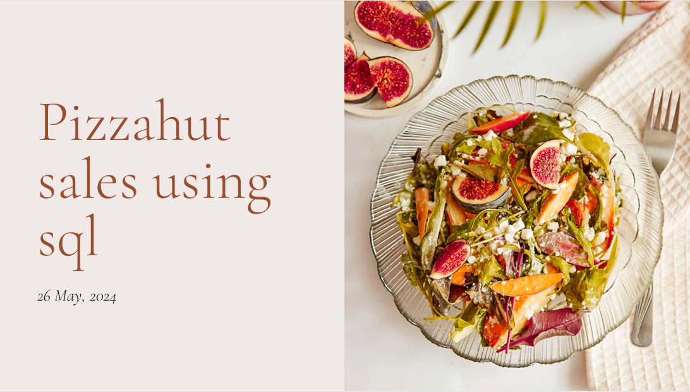

# Pizza Sales Business Insights Analysis

## SQL Data Analysis Project

This project analyzes **pizza sales data using SQL** to uncover business insights such as revenue trends, top-selling products, and customer ordering patterns.  
The analysis uses relational datasets including orders, order details, pizza types, and pricing information.

The objective of this project is to demonstrate how **SQL can be used to extract meaningful insights from transactional business data**.
# Pizza Sales Business Insights Analysis

## SQL Data Analysis Project

This project analyzes **pizza sales data using SQL** to uncover business insights such as revenue trends, top-selling products, and customer ordering patterns.
The analysis uses relational datasets including orders, order details, pizza types, and pricing information.

The objective of this project is to demonstrate how **SQL can be used to extract meaningful insights from transactional business data**.

---

## Tools & Technologies

* SQL
* PostgreSQL / MySQL
* Data Analysis
* Business Intelligence

---

## Dataset

The dataset contains transactional information from a pizza store and includes multiple related tables:

* `orders.csv` – order timestamps and order IDs
* `order_details.csv` – quantity and pizza ordered per order
* `pizzas.csv` – pizza size and price information
* `pizza_types.csv` – pizza categories and ingredients

These datasets were joined and analyzed using SQL queries.

---

## Key Analysis Performed

The project includes SQL queries to analyze:

* Total revenue generated
* Best-selling pizzas by quantity
* Top revenue-generating pizzas
* Sales distribution by pizza category
* Hourly and daily sales trends
* Customer ordering patterns

---

## Business Insights

The analysis helps identify:

* Most popular pizza categories
* Peak ordering hours
* High-revenue products
* Customer purchasing behavior

These insights can help businesses optimize **menu strategy, inventory planning, and marketing campaigns**.

---

## Example SQL Analysis

Example query used to calculate total revenue:

```id="k3t4sj"
SELECT SUM(quantity * price) AS total_revenue
FROM order_details od
JOIN pizzas p ON od.pizza_id = p.pizza_id;
```

---

## Project Structure

```id="zzldp2"
pizza-sales-sql
│
├── dataset
│   ├── orders.csv
│   ├── order_details.csv
│   ├── pizzas.csv
│   └── pizza_types.csv
│
├── sql_queries
│   ├── total_revenue.sql
│   ├── best_selling_pizzas.sql
│   ├── sales_by_category.sql
│   └── sales_trends.sql
│
└── README.md
```

---

## Author

**Sumit Dilipkumar Prasad**

GitHub: https://github.com/Sumit123sm
LinkedIn: https://linkedin.com/in/sumit-prasad-811736264
